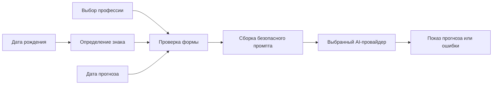

# Архитектура и стек

## Цель

Создать одностраничное веб-приложение без собственного сервера. Оно формирует развлекательный прогноз по трём данным:

1. IT-профессия пользователя.
2. Дата рождения, из которой определяется знак зодиака.
3. Дата, на которую нужен прогноз.

Ответ генерирует LLM. Текст должен быть коротким, доброжелательным, смешным, привязанным к профессии и знаку, с правдоподобными для роли успехами и рабочими рисками. Это творческий контент, а не предсказание или совет.

## Выбранный стек

| Зона | Выбор | Почему |
| --- | --- | --- |
| Приложение | React + TypeScript | Небольшой SPA с предсказуемыми компонентами и строгими типами. |
| Сборка | Vite | Быстрый и простой старт для статического сайта. |
| Стили | CSS Modules или обычный CSS с переменными | Не требует UI-фреймворка; токены и правила интерфейса определены в `docs/design.md`. |
| Формы | React state + чистая валидация | Полей мало; отдельная библиотека пока не нужна. |
| Тесты | Vitest | Подходит для чистой доменной логики и Vite-проектов. |
| Локальная LLM | Ollama HTTP API | Работает на компьютере пользователя и не требует ключа API для `localhost`. |
| Облачная LLM в будущем | Реализация того же интерфейса провайдера | Позволит подключить OpenAI-совместимый API или другого поставщика без изменения UI. |
| Хранение | `localStorage` | Достаточно для локальных настроек и последней заполненной формы. |
| Деплой | Статический хостинг | Vercel, Netlify, GitHub Pages либо аналог; сервер приложения не нужен. |

Не добавляем роутер, серверный фреймворк, базу данных, Redux, UI-kit или библиотеку дат на старте: для одного сценария они не окупаются.

## Пользовательский поток



### Доменная модель

```text
ForecastRequest
  professionId: ProfessionId
  birthDate: YYYY-MM-DD
  zodiacSign: ZodiacSign
  forecastDate: YYYY-MM-DD

Forecast
  text: string
  model: string
  generatedAt: ISO-8601

AiProviderSettings
  provider: "ollama" | "cloud"
  baseUrl: string
  model: string
```

`zodiacSign` вычисляется только из даты рождения и не должен редактироваться вручную. `professionId` выбирается из локального фиксированного справочника; к нему можно привязать описание типичных ситуаций для промпта.

## AI-слой

UI зависит от минимального контракта:

```text
generateForecast(request, options) -> Forecast
healthCheck() -> ProviderStatus
listModels?() -> Model[]
```

Первая реализация — `OllamaProvider`, который обращается к локальному Ollama. Вторая, отложенная, — `CloudProvider`. Обе реализации преобразуют свой HTTP-ответ в один `Forecast`; остальной код не знает о протоколе поставщика.

Для локального пути по умолчанию используются URL `http://localhost:11434` и выбранная пользователем модель. Ollama предоставляет локальный HTTP API, а его настройки допускают запросы с локальных web-origin; при проблеме CORS приложение должно показывать инструкцию, а не маскировать ошибку. См. официальные [введение в API Ollama](https://docs.ollama.com/api/introduction) и [FAQ по origin](https://docs.ollama.com/faq).

### Правила промпта

- Системная инструкция задаёт роль: автор ироничных, добрых IT-прогнозов на русском.
- Пользовательские значения передаются как структурированные поля, а не как свободный фрагмент инструкции.
- Указать формат: 2–4 предложения, упоминание профессии, знака и даты; один возможный успех и один комичный риск.
- Запретить категоричные обещания, оскорбления и профессиональные советы.
- Если ответ пустой или слишком длинный, показать понятную ошибку либо повторить запрос один раз только по явному действию пользователя.

## Конфигурация и безопасность

В статическом приложении допустимо публично задать URL локального Ollama и имя модели. Встраивать в сборку секрет облачного API нельзя: любой посетитель сможет его извлечь.

Поэтому есть два допустимых режима:

1. Для учебной локальной демонстрации пользователь явно вводит свой ключ облачного провайдера в настройках; ключ живёт только в памяти вкладки и не сохраняется.
2. Для публичного облачного режима позже добавляется тонкий серверный BFF/proxy, который хранит ключ и применяет ограничения запросов. Это отдельное изменение, не часть текущего требования «только веб».

Не отправлять дату рождения, историю прогнозов или настройки на сторонние сервисы без ясного уведомления. При локальном Ollama запрос остаётся на машине пользователя; при облачном режиме это надо прямо обозначить в интерфейсе.

## Ошибки и доступность

- До генерации проверять, что дата рождения и дата прогноза выбраны.
- В статусе загрузки блокировать повторную отправку.
- Отдельно объяснять: Ollama не запущен, модели нет, сеть недоступна, ответ модели не распознан.
- Для формы использовать нативные `label`, видимый текст ошибки и управление с клавиатуры.

## Структура будущего проекта

```text
src/
  app/
  domain/
    professions.ts
    zodiac.ts
    forecast.ts
  features/
    forecast-form/
    forecast-result/
    provider-settings/
  llm/
    types.ts
    ollama-provider.ts
    cloud-provider.ts
  lib/
tests/
```

Граница `domain`/`llm` обязательна. Остальная структура может оставаться плоской, пока приложение маленькое.
